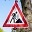

# **Traffic Sign Recognition** 

**Build a Traffic Sign Recognition Project**

The goals / steps of this project are the following:
* Load the [data set](https://s3-us-west-1.amazonaws.com/udacity-selfdrivingcar/traffic-signs-data.zip)
* Explore, summarize and visualize the data set
* Design, train and test a model architecture
* Use the model to make predictions on new images
* Analyze the softmax probabilities of the new images
* Summarize the results with a written report
---
Here is a link to [project code](https://github.com/sandeeppatil/CarND-Traffic-Sign-Classifier-Project/Traffic_Sign_Classifier.ipynb)

## Data Set Summary & Exploration

### 1. Basic summary of the data set

* The size of training set is 34799 images
* The size of the validation set is 4410
* The size of test set is 12630
* The shape of a traffic sign image is (32, 32, 3)
* The number of unique classes/labels in the data set is 43

### 2. Exploratory visualization of the dataset.

Here is an exploratory visualization of the data set.

## Design and Test a Model Architecture

### 1. Preporcess image data

*Grayscale Conversion:* This is done to reduce dimension for faster training

*Normalization:* Normalize the image (pixel - 128)/128 to get mean zero and equal Variance. This will ensure that each pixel has a similar data disturbution.

### 2. Model architecture 

My final model consisted of the following layers:

| Layer         		|     Description	        					| 
|:---------------------:|:---------------------------------------------:| 
|						|												|
| Input         		| 32x32x1 grayscale image						| 
|						|												|
| Convolution 5x5x1x6  	| 1x1 stride, VALID padding                     |
| RELU					| Activation function   						|
| Max pooling 2x2      	| 2x2 stride, VALID padding      				|
|						|												|
| Convolution 5x5x6x16 	| 1x1 stride, VALID padding                     |
| RELU					| Activation function   						|
| Max pooling 2x2      	| 2x2 stride, VALID padding      				|
|						|												|
| Flatten           	| Input:5x5x16 Output:400						|
|						|												|
| Fully Connected 		| Input:400 Output:120							|
| RELU					| Activation function   						|
| Dropout				| Keep Probability:0.5							|
|						|												|
| Fully Connected 		| Input:120 Output:84							|
| RELU					| Activation function   						|
| Dropout				| Keep Probability:0.5							|
|						|												|
| Fully Connected 		| Input:84 Output:43							|
|						|												|
 

### 3.Training Model

Optimizer: Adam Optimizer
Learning Rate: 0.001
Cross Entripy: Softmax Cross Entropy
Epochs: 200
Batch Size: 128

### 4. Results

Final model results:
* training set accuracy of 96.3%
* validation set accuracy of 96.7
* test set accuracy of 95%

## Test a Model on New Images

### 1. Five German traffic signs found on the web and their predection

### 2. Model's predictions

Here are the results of the prediction:

| Image			                        |     Prediction	       	| 
|:-------------------------------------:|:-------------------------:| 
| No Passing      		                | No Passing   				| 
| Speed limit (30km/h)	                | Speed limit (30km/h) 		|
| No entry				                | Yield						|
| Speed limit (30km/h) ("Zone" Text)	| Speed limit (30km/h)	  	|
| Road work 			                | Wild animals crossing		|

The model was able to correctly guess 4 of the 5 traffic signs, which gives an accuracy of 80%. 

### 3. This is how certain the model is when predicting on each of the five new images by looking at the softmax probabilities for each prediction. The top 5 softmax probabilities for each image (printed on top of image).

